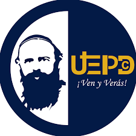
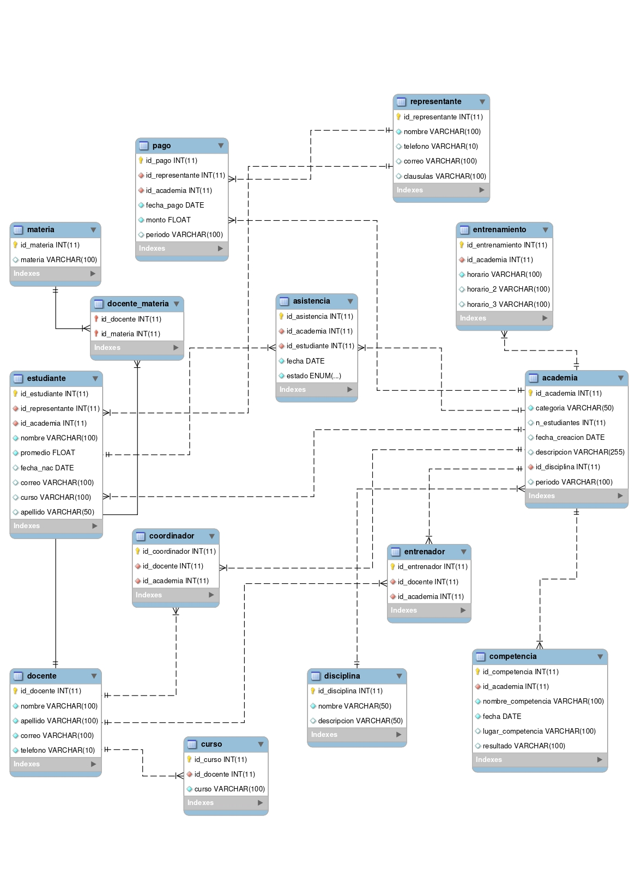

# Grupo 7 - Proyecto SBD
### Academia Comboni

* Adrian Toledo
* David Motoche
* Diego Apolo
* Frank Campozano
## Schema


## Instrucciones
* insertar el archivo `secrets.toml` en la carpeta `.streamlit`
* instalar las dependencias de python utilizando pip:
  ```bash
  pip install -r requirements.txt
  ```
* ejecutar webapp con streamlit:
  ```bash
  streamlit run appBasedeDatos.py
  ```
  o
  ```bash
  python -m streamlit run appBasedeDatos.py
  ```

* luego, ingresar a la pagina atraves de un navegador en `localhost:8501`

## Entregables
schema: [schema_diagrama.pdf](schema_diagrama.pdf)

script DDL: [script_base_de_datos.sql](script_base_de_datos.sql)

manual de usuario: [manual_usuario.pdf](manual_usuario.pdf)
